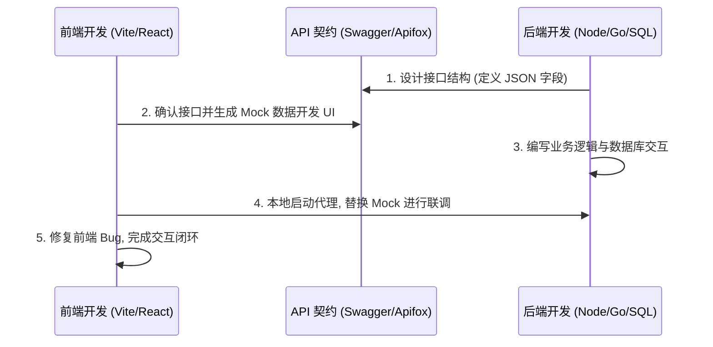

## Definition
Fullstack Integration is the process of connecting and consolidating front-end development and back-end development into a cohesive application. It involves ensuring seamless communication between the client-side (front-end) and server-side (back-end) components of an application by establishing effective interface standards and protocols. This integration process depends on api design to create common communication standards that both front-end and back-end teams can adhere to, creating a unified system.

## How it works
### Technical Explanation
Fullstack Integration begins with defining the boundaries between the front-end and back-end layers of an application via the design and implementation of APIs. Api design involves specifying the structure and behavior of these APIs, including input validation and expected outputs, essentially requiring a thorough understanding of both development environments and the services the application needs to provide.

One key technical challenge in this process is handling requests from different origins due to the browser’s same-origin policy. This is addressed through Cross-Origin Resource Sharing (CORS), which involves configuring the server to allow specified origins to access its resources. By setting appropriate headers and/or configuring a proxy server, the front-end can communicate directly with the back-end without restriction.

Another technical component of fullstack integration is handling user authentication and authorization. In a typical setup, JSON Web Tokens (JWT) are used to manage user sessions by encoding user-related data into a token that is sent with each request to verify the user’s identity across the network. This method of validating user identity and access permissions is crucial for a secure application architecture and builds on the concept of session management.

### Standard Workflow
The typical workflow for fullstack integration involves the iterative development of APIs and corresponding user interfaces. Using tools like Swagger or Apifox, the back-end development team can design the API endpoints required by the application, and the front-end team can use these specifications to develop UI components and functionality. This process requires close communication between both teams to ensure that the API and UI are aligned and capable of delivering the desired functionality.

## Variants
There are several methods for implementing fullstack integration, each with its own set of advantages and disadvantages:
- **CORS**: This is commonly used to allow cross-origin requests in scenarios where the front-end and back-end are hosted on different domains.
- **JWT**: An industry-standard method for secure user authentication in stateless systems.
- **OAuth**: A framework for access delegation which also builds on the concept of securing user authentication and authorization through various levels of access control.
- **GraphQL**: An alternative to traditional RESTful APIs, which can be used for more efficient and versatile data exchanges between the front-end and back-end.

Each variant implements or optimizes a different aspect of fullstack integration, addressing specific challenges in application design and development.

## Trade-offs
The trade-offs in fullstack integration often revolve around security, complexity, and performance. For instance, implementing JWT for authentication enhances security but adds complexity to setup and usage. Similarly, while enabling CORS is straightforward, it can lead to vulnerabilities if not configured correctly, requiring careful management of allowed origins and methods.

## See also
api design, api documentation, javascript frameworks, web security, cross-origin resource sharing