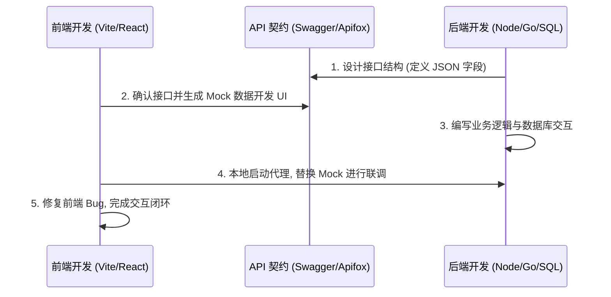

# 前后端联调与全栈整合

在现代 Web 开发中，前端和后端往往作为两个独立的项目运行。将它们连接并整合是构建完整应用的关键。

## 1. 跨域资源共享 (CORS)

当你在本地开发时，前端可能运行在 `http://localhost:5173` (Vite 默认端口)，而服务器运行在 `http://localhost:3000`。
由于浏览器的**同源策略 (Same-Origin Policy)**，前端向不同端口的后端发起请求会被拦截。

*   **解决方式**：
    1.  **后端开启 CORS**：在 Node.js (Express) 中配置 `cors` 中间件，或者在 Go 中添加允许跨域的 Response Headers：
        ```go
        w.Header().Set("Access-Control-Allow-Origin", "http://localhost:5173")
        ```
    2.  **前端配置代理 (Proxy)**：在 `vite.config.js` 中配置开发代理，将客户端请求代理转发到后端，欺骗浏览器以绕过同源策略。

---

## 2. 身份验证与授权 (Auth)

如何在无状态的 HTTP 协议中识别用户身份？

### JWT (JSON Web Token)
目前最流行的前后端分离认证方案。
1.  **登录**：用户提交账号密码，后端验证通过后生成一个加密的 JWT 字符串返回给前端。
2.  **存储**：前端将 JWT 存入 `localStorage` 或浏览器 `Cookie` 中。
3.  **请求携带**：前端在后续发起 API 请求时，在 HTTP Request Header 的 `Authorization` 中携带该 Token：
    ```http
    Authorization: Bearer <your-jwt-token>
    ```
4.  **校验**：后端收到请求，解密校验 Token 是否有效，有效则放行并读取用户信息，失效则返回 `401 Unauthorized`。

---

## 3. 全栈联调工作流

一个标准的前后端开发协作流程如下：



*   **API 文档规范**：使用 Swagger 或 Apifox 来统一定义接口输入输出，这是前后端协作最关键的契约。

